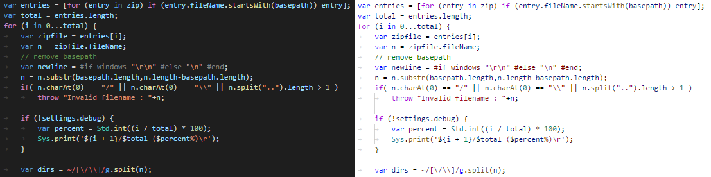
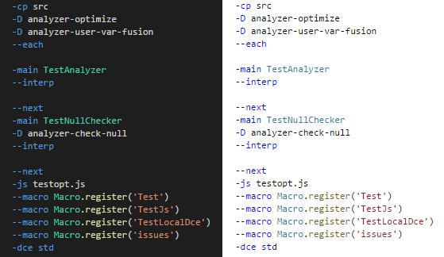

# haxe-TmLanguage

[](https://github.com/vshaxe/haxe-TmLanguage/actions?query=workflow%3ACI)

This repository contains `.tmLanguage` grammars for Haxe and HXML. They are currently used by the following projects:

- [vshaxe](https://github.com/vshaxe/vshaxe) (Haxe Extension for Visual Studio Code)
- [linguist](https://github.com/github/linguist) (used for github.com's syntax highlighting)
- [haxe.org](https://github.com/HaxeFoundation/haxe.org)

## Haxe example



## HXML example



## Building

First install the dependencies:

```
npm install
```

### Conversion

The `tmLanguage` XML files are converted from their `YAML-tmLanguage` source files like this:

```
npx lix run vshaxe-build --target tm-language-conversion
```

### Tests

There are some automated tests that can be run like this:

```
npx lix run vshaxe-build --target tm-language-tests
```

`/cases` contains the actual test cases. When running `build.js`, scope-annotated files are generated into the `/generated` directory. During the test step (running `test.js`), the files in `/baselines` are compared with the newly `/generated` ones, and the test fails if they are different.

So when adding a new test, follow these steps:

- create a new test case in `/cases`
- verify that the highlighting is ok
- run `build.js` and copy the new file in `/generated` into `/baselines`

## Workflow

For convenience, there exists a `tm-language` target, which runs both the `tm-language-conversion` and `tm-language-tests` targets. If you have this project open in VSCode, you can just execute the build task (<kbd>Ctrl</kbd>+<kbd>Shift</kbd>+<kbd>B</kbd>) to run the `tm-language` target.

VSCode currently needs to be restarted to pick up changes to grammar files. Hence it is helpful to assign an easily accessible shortcut to the `Reload Window` command, for instance <kbd>F6</kbd>. Sublime Text's [PackageDev](https://github.com/SublimeText/PackageDev) extension may offer a better workflow in this regard.

VSCode has a "Developer: Inspect Editor Tokens and Scopes" command that can be very helpful.
